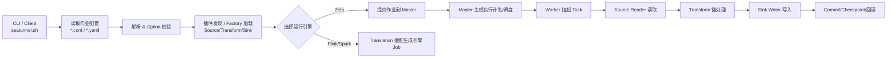
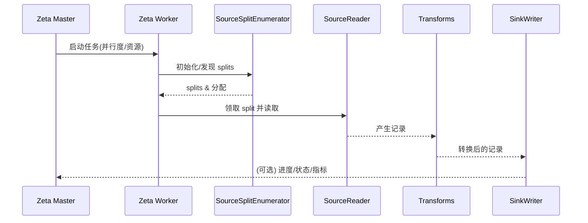

<!--
Licensed to the Apache Software Foundation (ASF) under one or more
contributor license agreements.  See the NOTICE file distributed with
this work for additional information regarding copyright ownership.
The ASF licenses this file to You under the Apache License, Version 2.0
(the "License"); you may not use this file except in compliance with
the License.  You may obtain a copy of the License at

   http://www.apache.org/licenses/LICENSE-2.0

Unless required by applicable law or agreed to in writing, software
distributed under the License is distributed on an "AS IS" BASIS,
WITHOUT WARRANTIES OR CONDITIONS OF ANY KIND, either express or implied.
See the License for the specific language governing permissions and
limitations under the License.
-->

# Apache SeaTunnel 运行流程（Review 基线）

本文件提供一份“足够稳定”的运行链路基线，用来帮助评审时做影响面分析与定位风险点。

> 说明：SeaTunnel 支持多引擎（Zeta / Flink / Spark）与多运行模式（batch / streaming）。评审时优先明确本次变更对应的引擎与模式，再套用链路分析。

## 1. 高层流程（从配置到执行）

评审要点：

- **配置/Option**：任何配置项名称、默认值、类型与语义是稳定契约；变更必须评估兼容性与迁移成本。
- **插件加载**：Factory/SPI 发现与类加载容易引入 shading/冲突/可用性问题；变更要关注“是否破坏插件可加载”。
- **调度与并发**：涉及 Master/Worker 交互、split 分发、任务并发模型的变更通常风险更高。

## 2. Source → Transform → Sink（数据路径）

典型数据路径可以简化为：

1. **Source SplitEnumerator**：负责发现数据分片（splits）、做分配/再均衡（并行度相关）。
2. **Source Reader**：拉取分片、读取外部系统数据、反序列化为 SeaTunnelRow/内部数据结构。
3. **Transform Chain**：对行进行映射/过滤/聚合等；可能涉及状态与性能热点。
4. **Sink Writer**：序列化并写入目标系统；需要关注幂等、事务、批次提交、失败重试语义。

评审要点：

- **Split 逻辑**：是否遗漏边界条件（空表/分区新增/权限异常/断点续传）？是否存在 split 泄露导致重复读取/丢数据？
- **并行度**：split 分配是否与并行度匹配？是否可能导致数据倾斜、热点与 backpressure？
- **写入语义**：writer 的 flush/commit/abort 是否一致？失败后是否可能重复写入或留下脏数据？

## 3. Streaming：Checkpoint 与恢复（高风险区）

在 streaming 模式下，变更需要额外评估：

- 状态是否可序列化/可升级（state schema evolution）？
- checkpoint 触发与 barrier 处理是否可能被阻塞（导致延迟/吞吐下降）？
- 恢复时是否能保证“至少一次/恰好一次”承诺（取决于 connector 支持与实现）？

## 4. 模块边界（用于架构合理性判断）

参考：`skills/seatunnel-code-review/references/MODULE_BOUNDARIES.md`

## 5. 评审时如何映射到问题清单

建议按“链路阶段 → 评审维度”映射：

- 配置/Option：兼容性、文档、默认值、副作用（新配置是否影响原行为）。
- 插件加载：依赖冲突、shading、SPI 稳定性、错误信息可诊断性。
- enumerator/reader：性能热点、并发安全、重试语义、资源释放。
- writer/commit：幂等/事务、失败回滚、重复提交风险、连接池与批量策略。
- streaming checkpoint：状态一致性、恢复语义、背压与超时。

