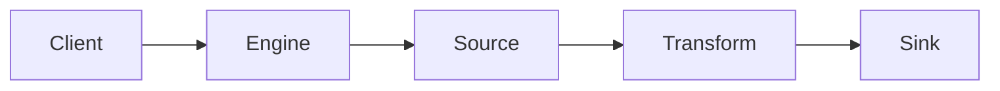

<!--
Licensed to the Apache Software Foundation (ASF) under one or more
contributor license agreements.  See the NOTICE file distributed with
this work for additional information regarding copyright ownership.
The ASF licenses this file to You under the Apache License, Version 2.0
(the "License"); you may not use this file except in compliance with
the License.  You may obtain a copy of the License at

   http://www.apache.org/licenses/LICENSE-2.0

Unless required by applicable law or agreed to in writing, software
distributed under the License is distributed on an "AS IS" BASIS,
WITHOUT WARRANTIES OR CONDITIONS OF ANY KIND, either express or implied.
See the License for the specific language governing permissions and
limitations under the License.
-->

# 功能设计文档（SeaTunnel）

## 1. 背景与问题陈述

- 背景：
- 问题：
- 目标（Goals）：
- 非目标（Non-goals）：
- 影响模块（API/Core/Zeta/Connector-V2/Transform-V2/Format/Translation/E2E）：
- 影响运行模式（Zeta/Flink/Spark；batch/streaming）：

## 2. 现状扫描（是否已有实现/相似实现）

> 要求：列出证据（至少 `path`，建议 `path:line`），并说明“已有能力 vs 需求差距”。

- 已有实现/相似实现清单：
  - `path/to/File.java:123`：一句话说明
- 差距与限制：

## 3. 需求与约束

- 功能需求：
- 非功能需求（性能/可用性/可观测性/安全）：
- 兼容性约束（Option/API/SPI/状态升级）：
- 外部系统约束（如 connector 目标系统特性）：

## 4. 备选方案调研（至少 2 个）

### 4.1 方案 A

- 简述：
- 优点：
- 缺点/风险：
- 复杂度与维护成本：

### 4.2 方案 B

- 简述：
- 优点：
- 缺点/风险：
- 复杂度与维护成本：

## 5. 方案选择与核心原则（简单/有效/稳定）

- 选择的方案：
- 为什么不选其他方案：
- 关键设计原则：

## 6. 详细设计

### 6.1 运行链路影响（基于 Runtime Flow）

- 影响阶段（勾选/补充）：
  - [ ] 配置解析与 Option 校验
  - [ ] 插件发现/Factory 加载
  - [ ] 引擎调度（Zeta：Client/Master/Worker）
  - [ ] Source：split/enumerator/reader
  - [ ] Transform：链路/状态/性能
  - [ ] Sink：writer/commit/幂等/事务
  - [ ] Checkpoint/恢复/容错（streaming）

### 6.2 API/Option/配置设计（如适用）

- 新增/修改配置项（Option）：名称/类型/默认值/描述
- 兼容性策略：

### 6.3 错误处理与可观测性

- 异常上下文（table/task/config key/split id 等）：
- 日志级别与敏感信息脱敏：
- 指标与监控建议：

### 6.4 架构图（必须：mermaid）

> 可补充 sequenceDiagram/stateDiagram，视复杂度而定。

## 7. 实现规划（建议可拆多 PR）

### 7.1 阶段拆分

- Phase 1：
  - 代码点位：
  - 测试：
  - 文档：
  - 风险与验证：
- Phase 2：

### 7.2 测试计划

- UT：
- IT/E2E：
- 性能/回归验证：

## 8. 兼容性/性能/安全评估（必填）

- 向后兼容：
- 性能副作用：
- 安全与敏感信息：

## 9. 优缺点与权衡

- 优点：
- 缺点：
- 权衡与原因：

## 10. 回滚/降级策略

- 回滚方案：
- 数据一致性影响：
- 监控与告警：

## 11. 开放问题（Open Questions）

- -

